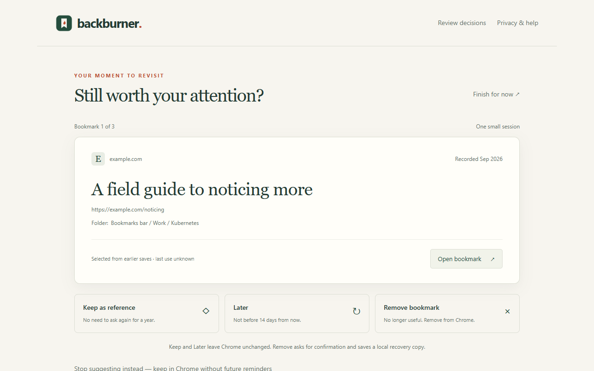

# Backburner

**Revisit the bookmarks you meant to come back to. Keep what matters. Resolve what no longer does.**

Backburner brings existing Chrome bookmarks into a small review. Open something interesting, keep it as a reference, defer it, or remove the bookmark after confirmation.



## Status: developer preview 0.1.5

This is a working extension candidate, not a Chrome Web Store release. Public launch still needs founder session-size calibration, a newcomer walkthrough, and store submission/review. The first preview session learns its size when you finish; that is not yet the final public default.

## Try locally

1. Download or clone the implementation branch `experiment/first-review`.
2. Open `chrome://extensions` in Chrome and enable **Developer mode**.
3. Choose **Load unpacked** and select the folder containing `manifest.json`.
4. Open Backburner from the Extensions menu; pin it if useful.

On Windows, `npm run package` creates `dist/backburner.zip` and extracts its exact runtime contents to `dist/unpacked`. Load the latter to test the package. A ZIP is a store upload artifact, not a one-click consumer install.

## Actions

The review shows the bookmark's current Chrome folder path beneath its URL for context, not folder management. Long ancestry is shortened visually before the leaf folder; long leaf names wrap. The full path remains available to assistive technology and in its tooltip. Root-level bookmarks and unavailable ancestry are labeled explicitly. Paths are derived from Chrome, refreshed on review and checked before acting, never saved as new metadata or included in notifications.

- **Open bookmark:** visit the page in another tab; the review waits here.
- **Keep as reference:** leave the bookmark in Chrome and stop asking about it.
- **Later:** leave it in Chrome and exclude it from review for at least 14 elapsed days. Choosing Later again restarts that wait.
- **Remove bookmark:** confirm one native bookmark's removal. Chrome may sync the change to other devices.
- **Stop suggesting instead:** a secondary action that retains the Chrome bookmark.

The completion screen reports factual action counts. **All done** closes the current Backburner tab; saved decisions and recovery copies remain available when you reopen it. **Review more bookmarks** starts another session in the same tab. It asks no survey questions and adds no feedback collection or adaptive behavior.

## Optional quiet reminders

Enable reminders once on the welcome screen or in **Privacy & help**, accepting Chrome's optional notification permission. Manual review works without it. Reminders are off until enabled, with no repeated permission prompts.

Backburner can offer one unresolved bookmark without a review page open: at most one notification attempt per seven elapsed days, between 09:00 and 18:00 local time. The first opportunity is after one week. Later becomes eligible after fourteen elapsed days; eligibility is not a promise of an immediate notification. Due Later items and other unresolved items share slots. Ignoring a reminder does not resolve it or escalate interruptions; that item waits at least fourteen days before another offer. These are initial product policies, not measured optima, and are not configurable schedules.

Notifications are silent and contain no bookmark titles or URLs. Clicking brings the selected bookmark into Backburner, never directly to its website. A one-item reminder review does not change manual batch size. If you have an unfinished session, Backburner offers an explicit resume/switch choice rather than overwriting it.

Chrome alarms can be late or disappear across restart; Backburner reconstructs the next opportunity from local state and never sends a catch-up burst. Chrome must be able to run. Sleep, quitting Chrome, denied permission and OS Focus/Do Not Disturb can delay or suppress notifications. API success does not prove you saw one. Interrupted delivery may miss a weekly slot rather than risk duplicate notifications. Check status or turn reminders off in **Privacy & help**; doing so retains decisions and recovery copies.

## Recovery has limits

Before removal, Backburner saves a local recovery copy containing the title, URL and original location. If that save fails, removal is not attempted. Use **Undo removal**, or **Review decisions → Removed bookmarks → Restore** after closing or restarting Chrome.

Restore creates a new bookmark. Original IDs and dates are not recovered; position is restored where possible. If the original folder is unavailable, confirm another destination. Copies remain until restored or explicitly forgotten. **Uninstalling Backburner or clearing extension storage destroys recovery copies.** Disabling retains them. Chrome sync is independent; Backburner cannot reverse all cross-device effects.

Interrupted operations remain visible for inspection. A possible completed restoration requires confirmation before another copy is created. Do not repeatedly retry, downgrade, or uninstall to fix an uncertain operation. See [support](SUPPORT.md).

## Local by design

No account, backend, history access, website scanning, or telemetry. Required permissions are `bookmarks`, `storage` and `alarms`; `notifications` is optional and requested only when you enable reminders. Native writes are limited to confirmed individual removal and explicit restoration. Read the [privacy policy](PRIVACY.md).

Selections use incomplete bookmark date metadata, not full browsing history or inferred interest. Non-HTTP(S) and credential-bearing URLs are excluded. Duplicate native bookmark entries are separate. New destinations become eligible again. No tags, folders to organize, New Tab replacement or endless feed.

## Development

Node 22+; no npm dependencies. On Windows:

```powershell
npm run package
npm test
```

Automated tests cover migration, decision transitions, removal/recovery failure boundaries, URL safety and package contents with good/bad controls. A separate synthetic Chrome for Testing journey validates the extracted package. Public release requires real human usability and store checks, not just mocks. See [release verification](release/reviewer-instructions.md).
